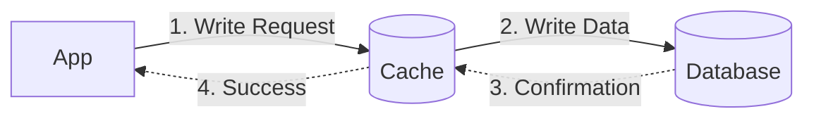
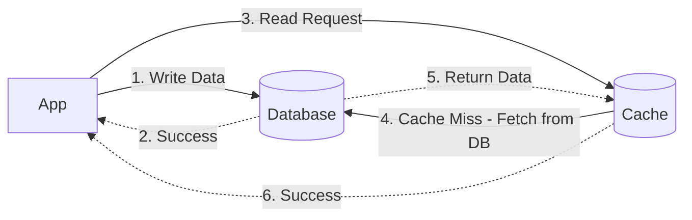
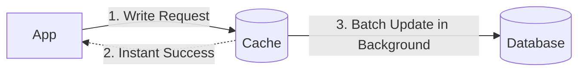
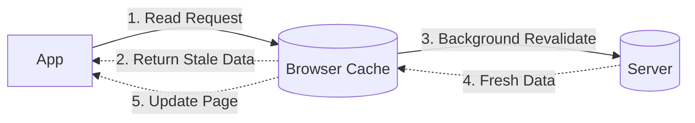

By now, Montu had mostly figured it out. But one doubt kept nagging at him. Before he could even say it, Boltu raised a hand to stop him.

— "I know what you're about to ask. The cache saved all the data, sure, but if the data changes in the main database (say someone edits a video's title), how does the cache find out? It'll just keep showing the user that old title! Right?"

Montu, stunned, said, — "Yes, Boltu! How did you know?"

Boltu smiled. — "Experience, kid! There's a famous saying in software engineering: **'There are only two hard things in Computer Science: cache invalidation and naming things.'** In other words, figuring out when and how to update the cache, so the user doesn't get served stale, rotten data, is a real pain. But don't panic, there are some great strategies for it."

To keep our cache fresh at all times, we have to follow a few special techniques when we write (**Write**) or update data. Let's see what they are:

### 1. Write-Through Cache

Remember the 'Read-Through' from a bit ago? This is its twin brother. Here, when updating data, the app updates **both** the **cache** and the **database** at the same time.

- **Process:** the app updates the cache first, then updates the database. Only once both are done does it give the user a 'Success' message.
- **Upside:** the data stays 100% consistent. Whatever's in the cache is also in the database.
- **Downside:** since you're writing to two places, writing data takes a bit longer (**High Latency**).
- **Example:** when someone changes a video's title on BiralTube, it's good to update it write-through style, so everyone sees the new title right away.

### 2. Write-Around Cache

You can tell from the name, this one 'steps around' or bypasses the cache.

- **Process:** the app writes data straight to the database. It doesn't touch the cache at all. So the old data sitting in the cache becomes invalid.
- **Next step:** later, when someone goes to read that data, there's a 'cache miss' (because the data isn't in the cache, or it's stale). Then the cache fetches the new data from the database again and updates itself.
- **Upside:** data that rarely gets read (like logs or archives) doesn't waste cache space.
- **Downside:** if someone comes to read right after the data is updated, they have to wait a bit (because of the cache miss).

### 3. Write-Back Cache (Write-Behind)

This one's the king of speed! Here the app takes the data from the user, saves it only to the cache, and immediately tells the user "all done!". But it hasn't actually saved to the database yet.

- **Process:** the cache writes all the stored-up data to the database in one go at set intervals (say every 1 minute), or when memory fills up (**Batch Update**).
- **Upside:** the write speed is insanely fast! The load on the database drops a ton.
- **Example:** your viral video scenario. Thousands of likes are landing every second. If you try to write every single like straight to the database, the database will keel over. Instead, bump the like count in the cache, and update the total to the database once every minute.
- **Big risk:** if the power cuts out or the server crashes right at the 1-minute mark, all the likes and data from that minute just vanish! Because they were never saved to the database.

Montu shook his head, a little confused. "Okay Boltu, so the system that's safe (Consistent) is slow. And the one that's fast risks losing data. Why does it have to be like that? Isn't there a best-of-both-worlds option?"

Boltu said, "In system design there's always a **Trade-off**. In plain terms, you can never have it all at once. Want speed? You give up a little data safety. Want airtight safety? Speed drops a little. As an engineer, you have to decide what matters most for your app."

"But those were the rules for 'writing' data. There are a few more popular methods for deleting or invalidating old data from the cache. Like:"

### TTL (Time-To-Live) Expiration

Before you put anything in your cache, you can say, "this data won't last more than 1 hour", meaning this data's lifespan (**TTL**) is 1 hour. Once that time's up, the data is automatically deleted from the cache. After that, if anyone asks, the cache fetches a fresh copy from the database. This way, even if old data sits in the cache, it never gets more than 1 hour stale.

### Stale-While-Revalidate (SWR)

This one's mainly handy for the frontend or browser. Say someone opens your profile. Instead of making them sit and wait for a load, the app first shows them yesterday's stale (**Stale**) profile from the browser cache. And in the background, it quietly fetches the fresh (**Revalidate**) data from the server. Once the new data arrives, it quietly snaps the page up to date. The user thinks, wow, this app is super fast!

There are also methods like **Purge** (force-deleting) or **Ban**. But for now, this much is enough for you.
