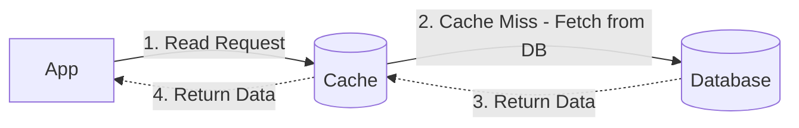
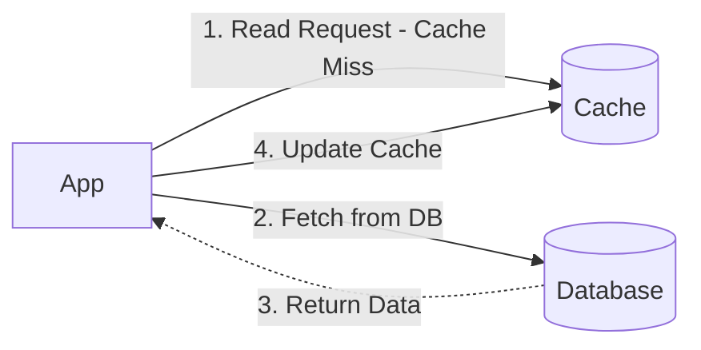

— "No, genius! You think you've got time to sit there deciding what gets cached? And how would you know ahead of time which video's going to go viral? There are mainly two processes, or strategies, for how this caching layer gets its data. Let's take a look."

### 1. Read-Through Cache - the helpful assistant

In this system, your app always asks the cache for data. The app doesn't even know the database exists.

- **Process:** the app tells the cache "give me the data".
  - If it's in the cache (**Cache Hit**): the cache hands the data over right away.
  - If it's not (**Cache Miss**): the cache itself goes to the database, fetches the data, saves a copy for itself, and gives it to the app.
- **Upside:** the app's code stays really simple. Fetching data from the database is entirely the cache provider's job.

### 2. Read-Aside Cache (Cache-Aside) - the lazy assistant

This is the most popular method. Here the cache is a bit lazy, you have to tell it everything.

- **Process:**
  - Your app checks the cache first. If it finds the data (**Hit**), great, take it and you're done.
  - If it doesn't (**Miss**), the app queries the database itself.
  - Along with showing the data to the user, the app saves that data into the cache itself, so next time someone asks, they get it straight from the cache.
- **Upside:** it's flexible to implement. You can cache exactly the data you need, nothing more. And Redis or Memcached are usually used with this very pattern.

Montu heard it all and said, "Got it! Read-Aside seems better for me. But Boltu, there isn't much room in RAM. What happens if the cache memory fills up? Do I have to go buy more RAM and plug it in?"
