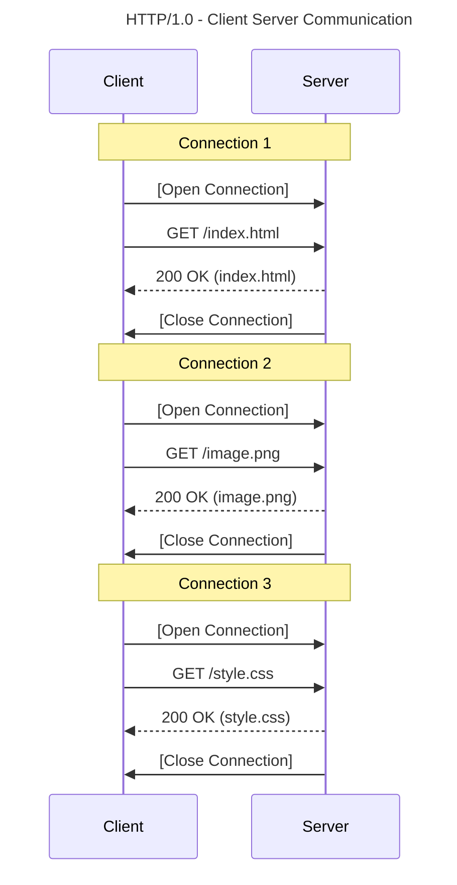
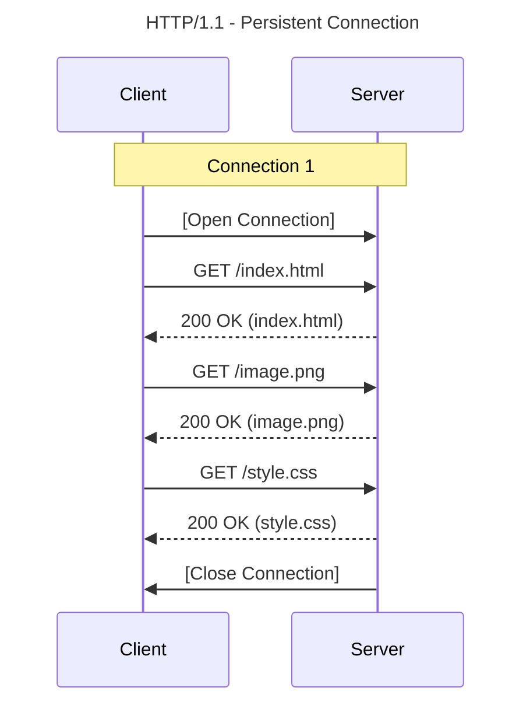
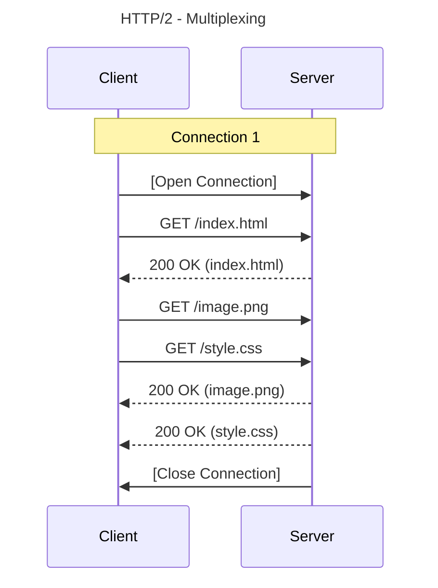
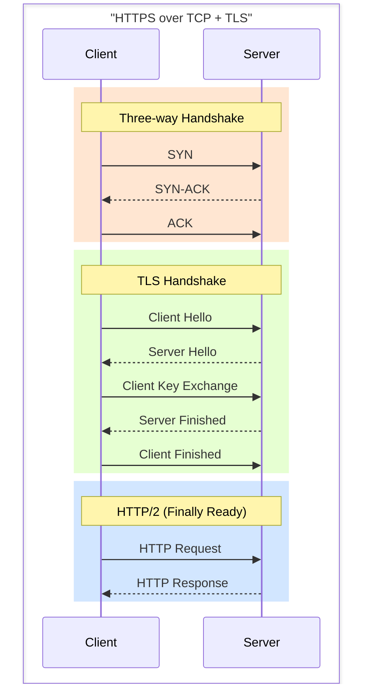
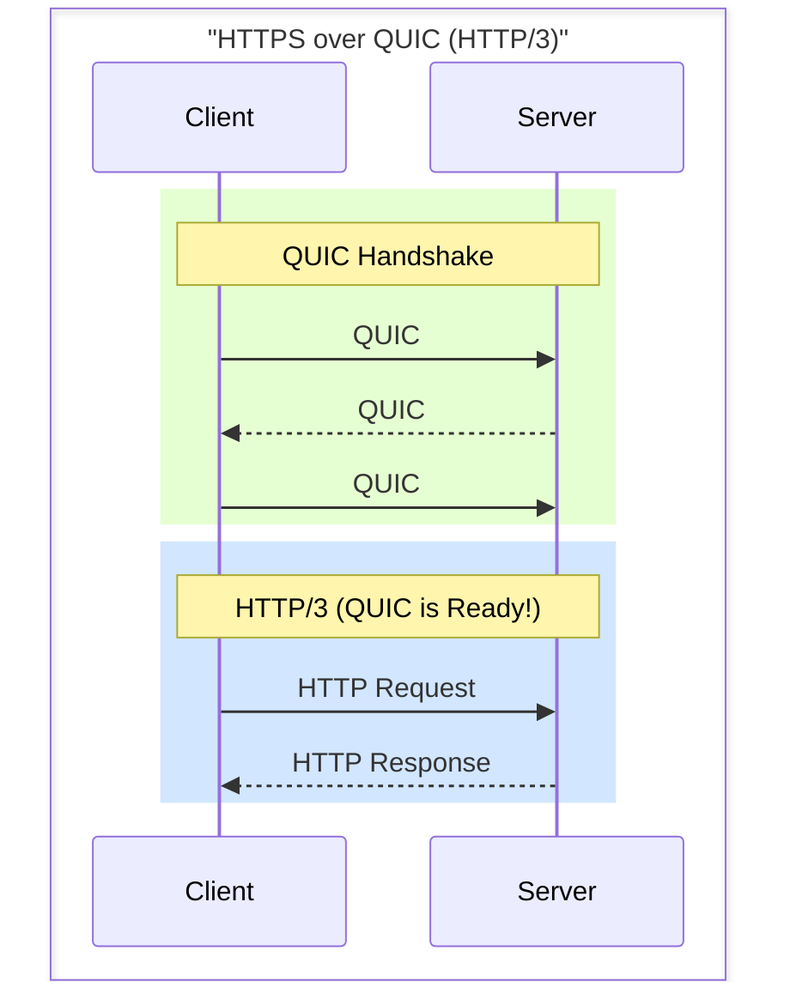

"Hey Boltu, while I was setting up the load balancer, something else caught my eye. There are several versions of this HTTP thing. Mind telling me about them?" Montu blurted out.

Boltu smiled. "There it is, now your real curiosity is kicking in! But this one's hard to explain in a single sentence. To really get it, we have to go a bit deep, and you need a little history of the internet too. Grab a pen and paper, here goes."

### HTTP/0.9 - the web begins

Picture 1991. A gentleman named Tim Berners-Lee first proposed this protocol. It was bare-bones. The client just stated the request type (method) and the path. That was it!

```http
GET /hello.html
```

The server's job was to take whatever resource lived at that path and send it straight to the user as text or HTML.

```html
<html>
  Hello World
</html>
```

Notice anything? There were no headers, no status codes, no metadata, none of it. Just "gimme" and "here you go". It was called the "one-line protocol".

### HTTP/1.0 - the expansion

Within about five years, engineers realized you can't run the world on plain text alone. Around 1996, everyone caught on to the huge potential of this 'World Wide Web'. People were starting to build all sorts of websites.
So the protocol needed to get a bit smarter. Alongside just the method and path, in came the protocol version, headers, a body, and a response code.

A request in HTTP/1.0 looked something like this:

```http
GET /profile.html HTTP/1.0
User-Agent: Chrome/143.0.0.0
```

So the structure became:

```plaintext
METHOD PATH PROTOCOL_VERSION
HEADERS [Optional]
BODY [Optional]
```

And the server would respond like this:

```http
HTTP/1.0 200 OK
Date: Tue, 28 Jan 2026 10:15:30 GMT
Server: cloudflare
Content-Type: text/html
<HTML>
 	Montu Mia's Profile
 	
</HTML>
```

Notice that when the server responds, it sends back a **'status code'** (like 200 OK). Whether the request succeeded or hit an error, you could tell straight from that code.

**Where the trouble started:**
HTTP/0.9's limits were gone, but a new headache began. Around then, people were starting to use images, CSS, and the like alongside text on their sites. And that's where HTTP/1.0's problem kicked in. In this version, **you had to open a separate connection for every single resource.**

Get it? Say your profile page has one HTML file and one image.

1. First, open a TCP connection for the HTML file (that three-way handshake), grab the file, close the connection.

2. Then, for the image, open a **brand new** connection all over again, grab the image, close it again.

If your page has 10 images, that's 10 rounds of opening and closing connections! For both the server and the client, that was a huge waste of effort, a ridiculous amount of overhead. So the engineers thought, "Hang on, instead of building a connection over and over, can't we do everything over a single one?"



And out of that very thought came a game changer...

### HTTP/1.1 - the standard is born

In 1997, **HTTP/1.1** dropped, and it completely reshaped the face of the internet. To kill that repeated-connection problem from the older version, it mainly brought two game-changing features:

**1. Keep-Alive (Persistent Connection):**
Boltu said, "The engineers thought, why open and slam the door shut for every single request? Once we've built a TCP connection, why not keep it 'open'? Until the work is done, all the data (HTML, CSS, Image) travels down that one road. This is called a **Persistent Connection**."

Montu jumped up. "Wait! That takes a ton of pressure off the server!"

— "Exactly! And as a result, website speed shot up in one leap too."

**2. Host Header:**
"This one's really important for that load balancer of yours. Earlier, you could only host one website per IP. But HTTP/1.1 added the `Host` header. Meaning, you can tell the server, 'Hey, I came to this IP, sure, but I want _montumia.com_, not _biraltube.com_.' That's what made it possible to host a thousand websites on one server (Virtual Hosting)."

It also packed in some other great features, like **cache control**, **Chunked Response** (showing the response bit by bit instead of waiting for all the data), and **Pipelining**.

This version was so solid that for the next 15 to 20 years, nobody even thought about anything new.

**But does every problem really get solved?**

HTTP/1.1 reigned for a long time, sure, but as sites got heavier (hundreds of images, piles of JavaScript), a new problem surfaced. Its name: **'Head of Line Blocking'**.

It's a lot like a traffic jam on a narrow road. In HTTP/1.1, even though you can pull many files over one connection, you have to do it serially (one after another).

Say there's a big video file at the front of the line, with a tiny CSS file right behind it. Now that little file is stuck waiting until the entire big video finishes loading. Like a motorbike stuck behind a big truck on the highway. The bike can't move until the truck does.

To clear that jam, **HTTP/2** was born.



### HTTP/2 - the magic of multiplexing

Boltu said, "In 2015, a bunch of big companies got together and said, enough! We can't take this jam anymore. And that's when **HTTP/2** arrived." To fix HTTP/1.1's 'bike stuck behind a truck' problem, it brought in one magical technique, **Multiplexing**.

Montu, surprised, said, "And what's that?"

— "Here's the simple version. Earlier, the big file would hog the whole road. HTTP/2 said, there'll still be just one road (Single Connection), but the data gets chopped into tiny pieces (Frames). A piece of the video goes, then a piece of the CSS file slips through the gap, then another piece of the video."

Picture it like this: everything gets chopped into pieces, mixed together, and sent down the pipe, and on the other end the browser reassembles each piece back into its file. So a small file no longer sits waiting on a big one. And if you want, you can even say, "this file matters more than that one, send it first and properly" (Stream Prioritization).

A few other big changes came too:

1. **Binary Protocol:** earlier everything was plain text, which humans could read. But computers understand binary (0s and 1s) better. So HTTP/2 converted the whole communication system to binary. That bumped up speed and cut down parsing errors.

2. **Header Compression (HPACK):** earlier, every request shipped the same headers (like User-Agent) over and over. HTTP/2 said, "why keep repeating yourself?" and compressed the headers down to a fraction of the size.

3. **Server Push:** even before the client asked, the server would figure, "ah, they'll need the CSS along with the HTML." So it would push the CSS file over without being asked.

Montu, delighted, said, "So that solves every problem, Boltu! What more could you want?" Boltu let out a sigh. "That's what everyone thought. But what do you do when the call is coming from inside the house?"



### HTTP/3 - the protocol revolution

HTTP/2 cleared the application-layer jam (Head of Line Blocking), true, but at the end of the day it still leans on **TCP**. And TCP is that same fussy gentleman.

If even 1 of 100 packets goes missing on a TCP connection, TCP says, _"Stop! Until that packet number 1 arrives, the other 99 can't be processed."_ This is called **TCP Head of Line Blocking**. Meaning, no matter how much HTTP/2 multiplexes, if a packet is lost on the underlying network, the whole thing slams to a crawl.

> Quick note: keep one thing in mind here. When a file or resource gets chopped up at the software layer, you get **'Frames'**. When that frame gets chopped up at the network layer, you get **'Packets'**. HTTP/2 could clear the jam of frames, but not the jam of packets (at the TCP layer).

To fix this, the engineers made a wild call. They said, "TCP isn't going to cut it anymore. It's too slow and too much of a drama queen. Drop it!"

Montu's jaw hit the floor. "Drop TCP? Then who gives us reliability? That careless **UDP**?"

— "Exactly! Google said, we'll build a new protocol on top of UDP, called **QUIC** (Quick UDP Internet Connections). And built on that, in 2022, came **HTTP/3**."

**The magic of HTTP/3 (QUIC):**

1. **UDP's speed, TCP's trust:** it runs on UDP (so connections are fast), but checks at the software layer (QUIC) whether the data arrived. Basically, TCP's good qualities got rewritten from scratch, minus TCP's slowness.

2. **Real multiplexing:** here, if one video packet goes missing, only the video stalls. The CSS file or other images right next to it load just fine. It won't freeze everyone for one straggler the way TCP does.

3. **Built-in encryption (TLS 1.3):** earlier there was a TCP handshake, then another TLS handshake on top (which took ages). In HTTP/3, the handshake and the encryption happen together. A connection in the blink of an eye!

<div className="grid grid-cols-1 md:grid-cols-2 gap-4">





</div>

Boltu said, draining the last of his tea, "Not every site has moved to HTTP/3 yet, because it's a bit complex to implement. But all of YouTube and Google's services already use it. When BiralTube gets big, you'll need it too."

Closing his notebook, Montu thought, "Networking isn't nearly as boring as I'd figured. Honestly, it's pretty thrilling!"
