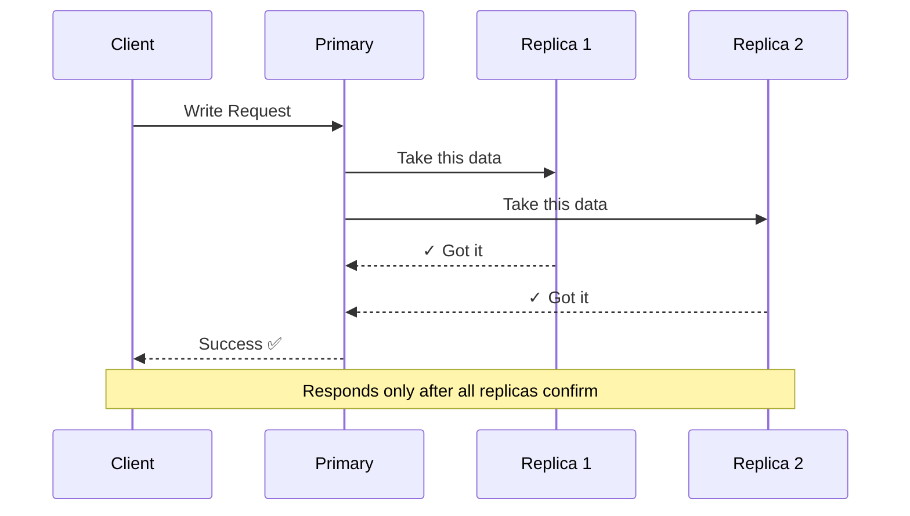
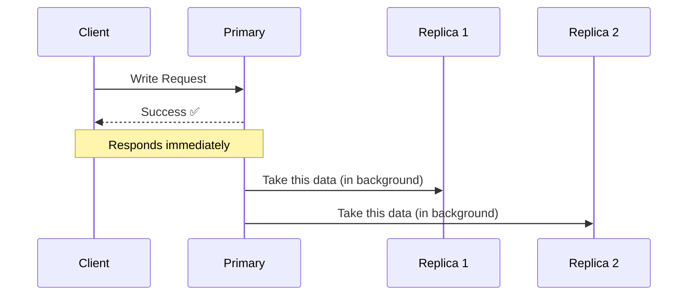
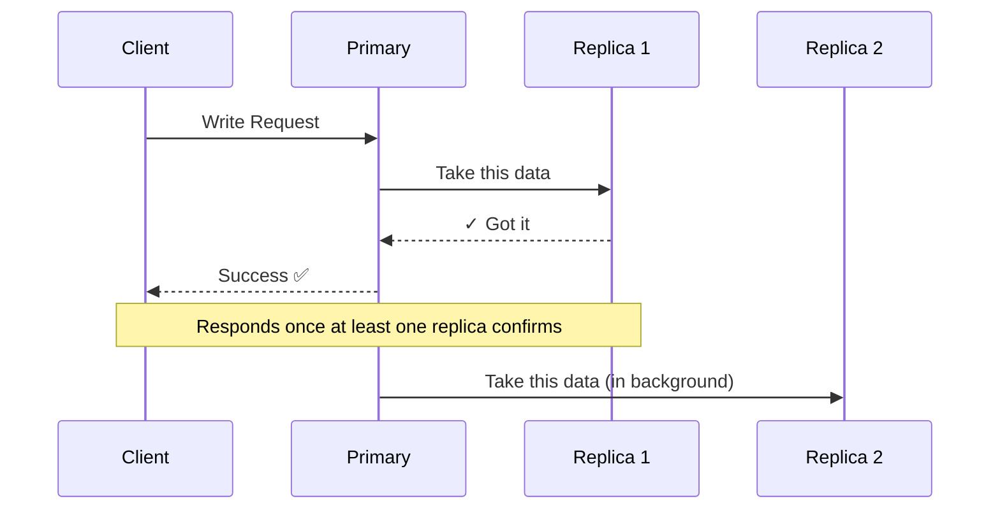

Boltu took a sip from his coffee mug and started explaining. "The whole point of replication is keeping your primary server in constant contact, or sync, with the rest of your redundant servers. Say new data lands in your primary database, the system automatically makes a carbon copy of that data on all the other servers, all on its own."

Montu let out a sigh of relief. "Phew, saved! No more sitting around manually copy-pasting. But Boltu, this automatic update, when does it actually happen? When a user sends a request, do you make them sit and wait until it's copied to every server? Or do you tell the user 'all done' and send them off, then calmly update in the background later?"

Boltu said, "Great question! It can actually go both ways. You choose the mechanism based on what matters more: perfectly consistent data, or a faster system. These are called 'Replication Strategies'."

### 1. Synchronous Replication: snail's pace, but a 100% guarantee

"What you said first, making the user wait, that's the synchronous process. Say some data gets written to the primary database. Now the primary server sends that data to all its replica servers. Until every single replica sends back a 'yep, got the data' confirmation, the primary server gives the client no success response. Only after all the replicas are updated does the user find out their work is done."

— "But Boltu, if you wait for data to copy to ten servers, the system's speed goes straight down the drain! The user gets bored and bails."

— "Spot on. The system will be dead slow, but your data will be 100% safe and identical everywhere. This is called 'Strong Consistency'. Anywhere data accuracy matters more than speed, this is a must. Take a banking system, 10,000 dollars gets deducted from your account, but the replica server is slow to update, and in between you fire off another transaction! In cases like that, slow or not, there's no alternative to synchronous replication."

### 2. Asynchronous Replication: rocket speed, but full of risk

Boltu went on, a bit more relaxed now. "Then there are systems where speed is everything. There, the moment data is written to the primary database, we send the user a 'Success' response right away. After that, the replicas update at their own pace in the background. That's asynchronous replication."

Boltu paused, then continued. "Take your BiralTube. If a like on some video doesn't update for every user on earth instantly, the world won't end. But if you make the user wait three seconds after clicking the like button, they'll uninstall your app and run. In cases like that, the smart move is to accept 'Eventual Consistency' and crank up the speed."

Montu fell into thought. He furrowed his brow. "I get it, Boltu. But one thing is really bugging me. What if the primary server crashes before the data even gets copied to the replicas? The client already thinks the data is saved, but in the background it never got copied! Then that data's gone forever!"

— "Bravo! Now you're starting to think like a real engineer. Yes, in an asynchronous system, if the primary fails, whatever data the replicas hadn't received yet is gone. And to cut down exactly that risk, there's another hybrid solution."

### 3. Semi-Synchronous: the clever middle ground

Boltu continued. "With this method, you get to have it both ways. After data is written to the primary database, you only wait until the data is copied to at least one replica server. The moment that one replica confirms, you send the response back to the client. After that, the rest of the replicas keep updating asynchronously."

Montu's eyes lit up.

— "What did that get us? Since you don't have to wait for ten servers like in synchronous, the speed stays reasonably fast. And there's no data-loss risk like in asynchronous, because even if the primary server suddenly dies, that one updated replica is still alive! Make it the new primary right away and you lose no data."

— "Nice! Brilliant trick. Boltu, this is exactly what I was looking for. I'll implement this for BiralTube. Come on, let's start writing code!"

Boltu laughed, grabbed Montu by the collar, and sat him back down. "Whoa there, why are you bouncing around? The real game's only just begun. You understand how data syncs, but among all these servers you still have to set up the mechanism for who's the boss (Leader) and who's the sidekick (Follower), right?"
