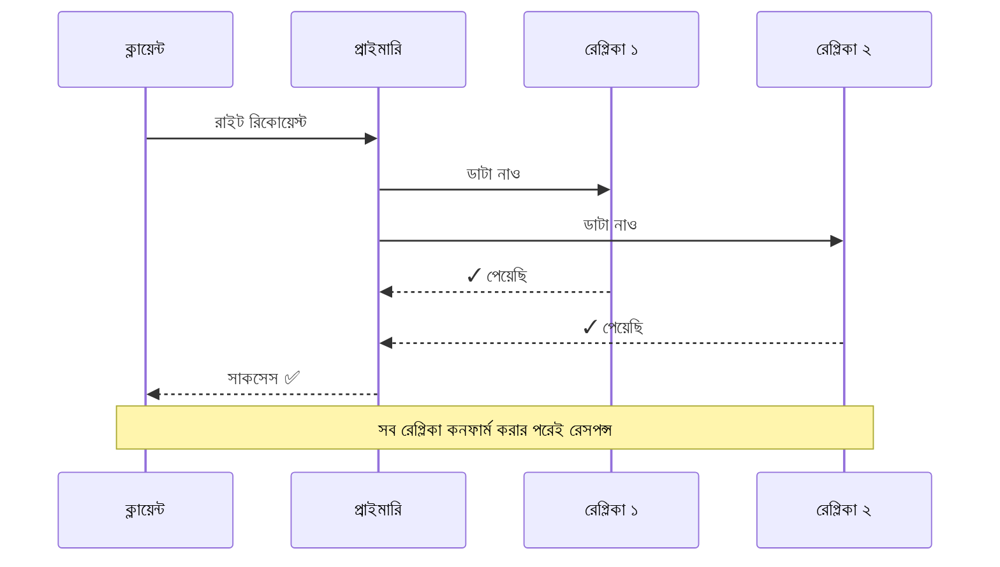
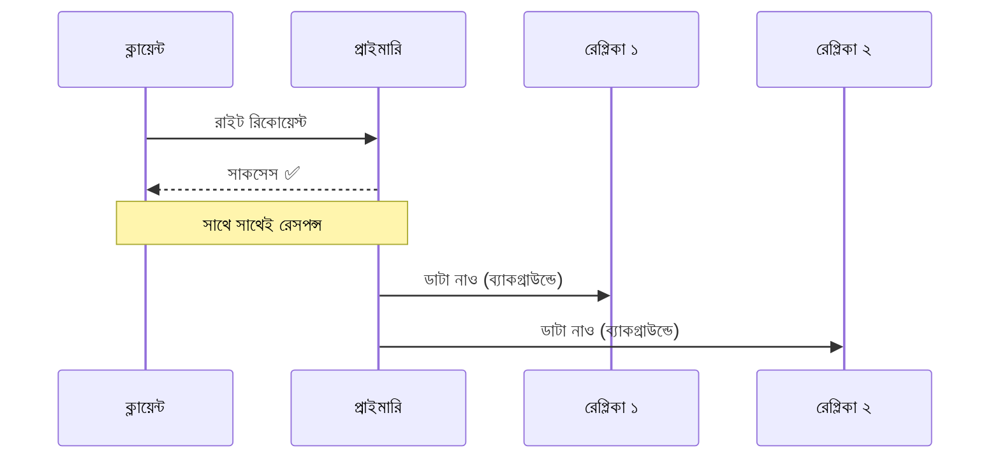
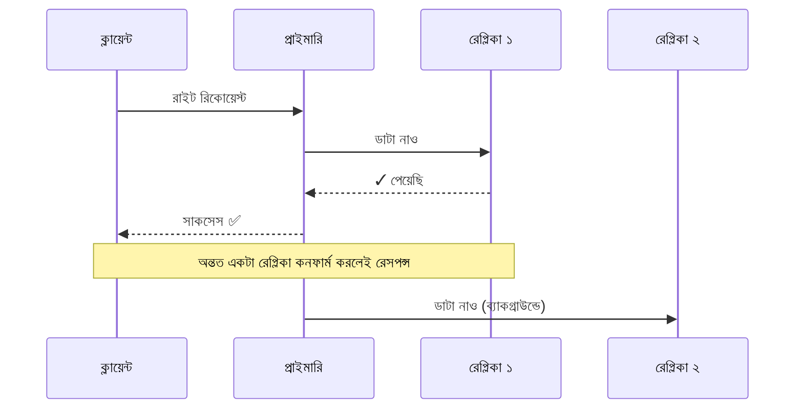

বল্টু ভাই কফির মগে চুমুক দিয়ে বোঝানো শুরু করলেন, “রেপ্লিকেশনের মূল কাজ হলো তোর প্রাইমারি সার্ভারের সাথে বাকি রিডান্ডেন্ট সার্ভারগুলোর সার্বক্ষণিক যোগাযোগ বা সিঙ্ক (Sync) রাখা। ধর, তোর প্রাইমারি ডাটাবেজে নতুন একটা ডাটা ঢুকল, সিস্টেম নিজে থেকেই অটোমেটিকভাবে বাকি সার্ভারগুলোতে সেই ডাটার কার্বন কপি বানিয়ে ফেলবে।”

মন্টু স্বস্তির হাসি হাসল, “যাক বাঁচা গেল! আমার আর বসে বসে ম্যানুয়ালি কপি-পেস্ট মারতে হবে না। কিন্তু ভাই, এই যে অটোমেটিক আপডেট, এটা আসলে কখন ঘটে? ইউজার রিকোয়েস্ট দিলে কি তাকে বসিয়ে রেখে সব সার্ভারে কপি হওয়া পর্যন্ত ওয়েট করানো হয়, নাকি ইউজারকে ‘কাজ শেষ’ বলে বিদায় করে দিয়ে পরে ঠান্ডা মাথায় ব্যাকগ্রাউন্ডে আপডেট হয়?”

বল্টু ভাই বললেন, “দারুণ প্রশ্ন! আসলে দুই ভাবেই হতে পারে। তুই ডাটা কতোটা নিখুঁত চাস আর সিস্টেম কতোটা ফাস্ট চাস, তার ওপর ভিত্তি করে এই মেকানিজম সাজাতে হয়। এদেরকে বলা হয় ‘রেপ্লিকেশন স্ট্র্যাটেজি’ (Replication Strategy)।”

### ১. সিঙ্ক্রোনাস (Synchronous) রেপ্লিকেশন: কচ্ছপ গতি, কিন্তু শতভাগ গ্যারান্টি

“তুই শুরুতে যেটা বললি, ইউজারকে বসিয়ে রাখা, এটাই হলো সিঙ্ক্রোনাস প্রক্রিয়া। ধর, প্রাইমারি ডাটাবেজে কোনো ডাটা রাইট হলো। এবার প্রাইমারি সার্ভার তার সব রেপ্লিকা সার্ভারে সেই ডাটা পাঠাবে। যতক্ষণ না সব কয়টা রেপ্লিকা থেকে ‘হ্যাঁ ভাই, আমি ডাটা পেয়েছি’ টাইপ কনফার্মেশন আসছে, ততক্ষণ প্রাইমারি সার্ভার ক্লায়েন্টকে কোনো সাকসেস রেসপন্স দেবে না। সব রেপ্লিকা আপডেট হওয়ার পরেই কেবল ইউজার জানবে তার কাজ হয়েছে।”

— “কিন্তু ভাই, দশটা সার্ভারে ডাটা কপি হওয়ার জন্য ওয়েট করলে তো সিস্টেমের স্পিডের বারোটা বেজে যাবে! ইউজার তো বোরিং হয়ে পালাবে।”

— “একদম ঠিক ধরেছিস। সিস্টেম চরম স্লো হবে, কিন্তু তোর ডাটা থাকবে ১০০% সেইফ এবং সব জায়গায় হুবহু এক। একে বলে ‘স্ট্রং কনসিস্টেন্সি’ (Strong Consistency)। যেসব জায়গায় স্পিডের চেয়ে ডাটার অ্যাকুরেসি বেশি ম্যাটার করে, সেখানে এটা মাস্ট। ধর ব্যাংকিং সিস্টেম, তোর অ্যাকাউন্ট থেকে ১০ হাজার টাকা কাটা গেল, আর রেপ্লিকা সার্ভারে আপডেট হতে দেরি হলো, মাঝখান দিয়ে তুই আরেকটা ট্রানজেকশন মেরে দিলি! এসব ক্ষেত্রে স্লো হলেও সিঙ্ক্রোনাস রেপ্লিকেশন ছাড়া গতি নেই।”

### ২. অ্যাসিঙ্ক্রোনাস (Asynchronous) রেপ্লিকেশন: রকেটের গতি, কিন্তু রিস্কে ভরা

বল্টু ভাই এবার একটু রিল্যাক্সড ভঙ্গিতে বললেন, “আবার ধর এমন কিছু সিস্টেম, যেখানে স্পিডই সব। সেখানে আমরা প্রাইমারি ডাটাবেজে রাইট হওয়ার সাথে সাথেই ইউজারকে ‘সাকসেস’ রেসপন্স পাঠিয়ে দিই। এরপর ব্যাকগ্রাউন্ডে রেপ্লিকাগুলো তাদের নিজেদের মতো করে ধীরে সুস্থে আপডেট হতে থাকে। এটাই অ্যাসিঙ্ক্রোনাস রেপ্লিকেশন।”

বল্টু ভাই একটু থেমে আবার বললেন, “তোর বিড়ালটিউবের কথাই ধর। কোনো ভিডিওতে লাইক মারলে সেটা সাথে সাথে পৃথিবীর সব ইউজারের কাছে আপডেট না হলেও কারো মহাভারত অশুদ্ধ হবে না। কিন্তু লাইক বাটনে ক্লিক করার পর তুই যদি ইউজারকে তিন সেকেন্ড বসিয়ে রাখিস, তাহলে তোর অ্যাপ আনইনস্টল করে ইউজার ভেগে যাবে। এসব ক্ষেত্রে ‘ইভেনচুয়াল কনসিস্টেন্সি’ (Eventual Consistency) মেনে নিয়ে স্পিড বাড়ানোই বুদ্ধিমানের কাজ।”

মন্টু একটু চিন্তায় পড়ে গেল। ভুরু কুঁচকে বলল, “বুঝলাম ভাই। কিন্তু আমার তো একটা জায়গায় মারাত্মক খটকা লাগছে। প্রাইমারি সার্ভার থেকে রেপ্লিকাতে কপি হওয়ার আগেই যদি প্রাইমারি সার্ভারটা ক্র্যাশ করে? ক্লায়েন্ট তো জেনে গেছে ডাটা সেভড, কিন্তু ব্যাকগ্রাউন্ডে তো কপিই হলো না! তাহলে তো সেই ডাটা চিরতরে হাওয়া!”

— “শাবাশ! এই তো তুই আসল ইঞ্জিনিয়ারের মতো ভাবতে শুরু করেছিস। হ্যাঁ, অ্যাসিঙ্ক্রোনাস সিস্টেমে প্রাইমারি ফেইল করলে যেটুকু ডাটা তখনো রেপ্লিকা পায়নি, সেটুকু হাওয়া। আর এই রিস্ক কমানোর জন্যই আছে আরেকটা হাইব্রিড সলিউশন।”

### ৩. সেমি-সিঙ্ক্রোনাস (Semi-Synchronous): মাঝখানের চালাকি

বল্টু ভাই বলে চললেন, “এই পদ্ধতিতে তুই দুই কূলই রক্ষা করতে পারবি। প্রাইমারি ডাটাবেজে রাইট হওয়ার পর, তুই শুধু অন্তত একটা রেপ্লিকা সার্ভারে ডাটা কপি হওয়া পর্যন্ত ওয়েট করবি। ওই একটা রেপ্লিকা কনফার্মেশন দিলেই তুই ক্লায়েন্টকে রেসপন্স পাঠিয়ে দিবি। এরপর বাকি রেপ্লিকাগুলো অ্যাসিঙ্ক্রোনাস ওয়েতে আপডেট হতে থাকবে।”

মন্টুর চোখ চকচক করে উঠল।

— “এতে লাভ কী হলো? সিঙ্ক্রোনাসের মতো ১০টা সার্ভারের জন্য ওয়েট করতে হলো না বলে স্পিড মোটামুটি ফাস্ট থাকল। আবার অ্যাসিঙ্ক্রোনাসের মতো ডাটা হারানোর রিস্কও থাকল না। কারণ প্রাইমারি সার্ভার হুট করে মরে গেলেও, তোর ওই একটা আপডেটেড রেপ্লিকা তো বেঁচে আছে! সেটাকে সাথে সাথে নতুন প্রাইমারি বানিয়ে ফেললে আর কোনো ডাটা লস হবে না।”

— “বাহ! অসাধারণ চালাকি তো। আমি তো ভাই এটাই খুঁজছিলাম। বিড়ালটিউবের জন্য আমি এটাই ইমপ্লিমেন্ট করব। চলেন ভাই, কোড লেখা শুরু করি!”

বল্টু ভাই হেসে মন্টুর কলার চেপে ধরে বসালেন, “আরে বস, এত লাফাচ্ছিস কেন? আসল খেলা তো কেবল শুরু। ডাটা কীভাবে সিঙ্ক হবে সেটা বুঝলি, কিন্তু এই এতগুলো সার্ভারের মধ্যে কে বস (Leader) আর কে চামচা (Follower), সেই মেকানিজম তো সেট করতে হবে, তাই না?”
