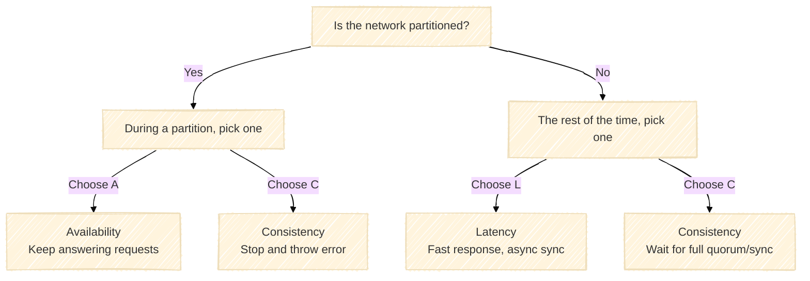

"Nothing to panic about," Boltu Bhai chuckled. "The big limitation of the CAP theorem is that it only applies when the system experiences a 'Network Partition (P)' or connection loss. But your servers aren't down all day long, are they? 99% of the time, everything is running totally fine, right?"

Montu nodded. "Yeah, most of the time it's fine."

"Even when everything is fine, you still have to make another critical decision. Break down the PACELC theorem, and it'll all make sense:

- **PAC:** If there is a **P**artition (network issue), do you choose **A**vailability or **C**onsistency? (Which you just learned)
- **ELC:** **E**lse (when everything is working normally), do you choose **L**atency (speed) or **C**onsistency (flawless accuracy)?"

Montu looked confused. "When everything is fine, what kind of trade-off could there possibly be between speed and flawless data?"

"Take your BiralTube, for instance," Boltu Bhai began to explain. "All server connections are healthy. A user likes a video. If you prioritize Latency (speed), the system will quickly confirm the write on the local server and instantly respond to the user, while pushing the updates to the other servers quietly in the background (asynchronous replication). Because of this background sync lag, other users might see a slightly older like count for a brief few milliseconds.

On the other hand, if you prioritize Consistency, the system can't just take shortcuts. Before confirming that write, it has to coordinate with a leader or a quorum (a majority of nodes) to make sure everyone is on the same page. All that extra network chatter and round-trip coordination takes time, meaning the user who hit 'like' will have to wait longer for a response—so your Latency goes up."

Montu finally had a lightbulb moment. "That means, Bhai, there is no magic in the database world. If I'm building a real-time chat app or BiralTube, I have to prioritize speed, or Latency. But if I'm building a banking transaction system, I have to prioritize Consistency, even if it runs a little slower."

Boltu Bhai patted Montu on the back. "Exactly! You're finally starting to think like a real software architect."

The fog in Montu's head finally cleared. He realized that in system design, there is no magic, only trade-offs. If you want more of one thing, you always have to give up a bit of something else.

Montu smiled. "Thanks, Boltu Bhai! I was spending all this time looking for speed and perfection at the same time. Now I get it, for BiralTube, I need to design my system keeping AP (Availability) and Latency in mind."

Boltu Bhai set his teacup down on the table and smiled warmly. "There you go, you've nailed it."
